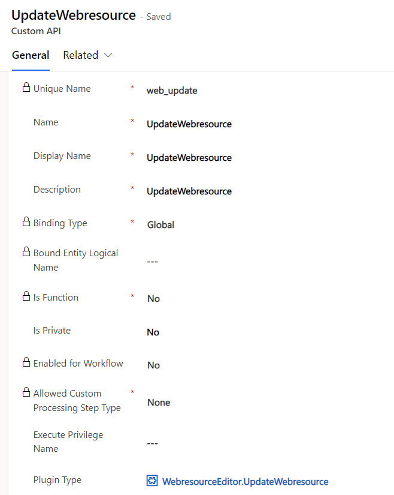
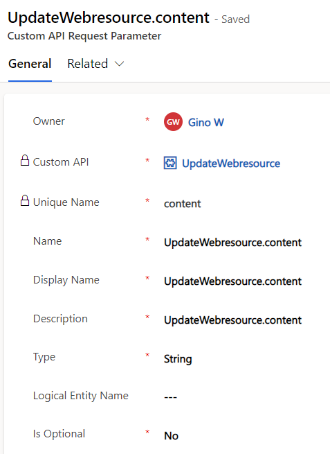
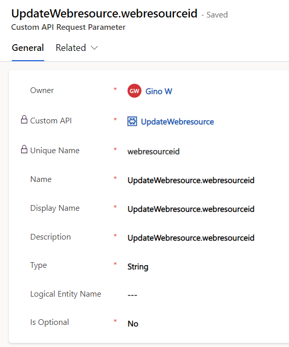
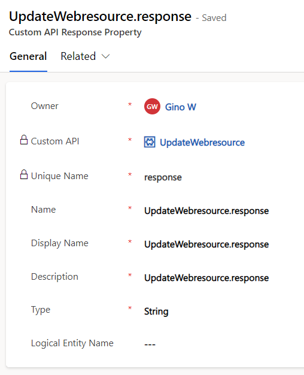
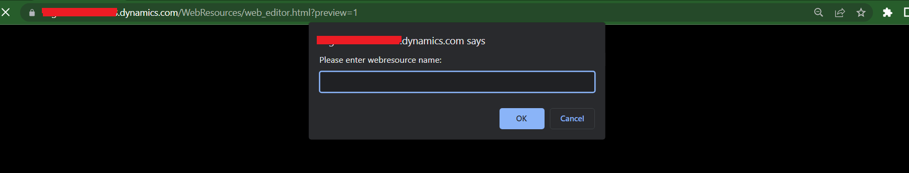

## Installation

- Download and import the managed solution `WebresourceEditor_managed.zip` from the `solution` folder of this project.
- Follow below steps to create Custom API definitions:

  1. Create new solution, give any name (eg. CustomAPI)
  2. In the solution create new Custom API as below:

     

  3. Create two Custom API Request Parameters as below:

     
     

  4. Create Custom API Response Parameter as below:

     

## Usage

- Open the HTML file (`<your_org_here>/WebResources/web_editor.html`).
- Enter any webresource name you want to edit.

  

  For example for below webresource the name will be `con_samplewebresource.js`

  

- Press CTRL+S to save and CTRL+P to publish.

  

- Press CTRL+O to open the webresource in new tab.

## References

- Monaco editor: https://microsoft.github.io/monaco-editor/playground.html

