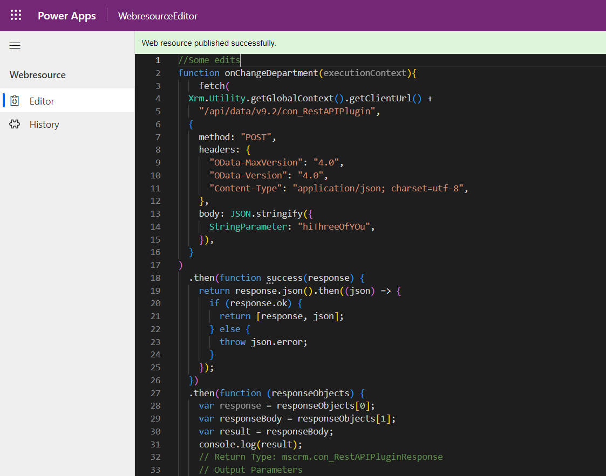
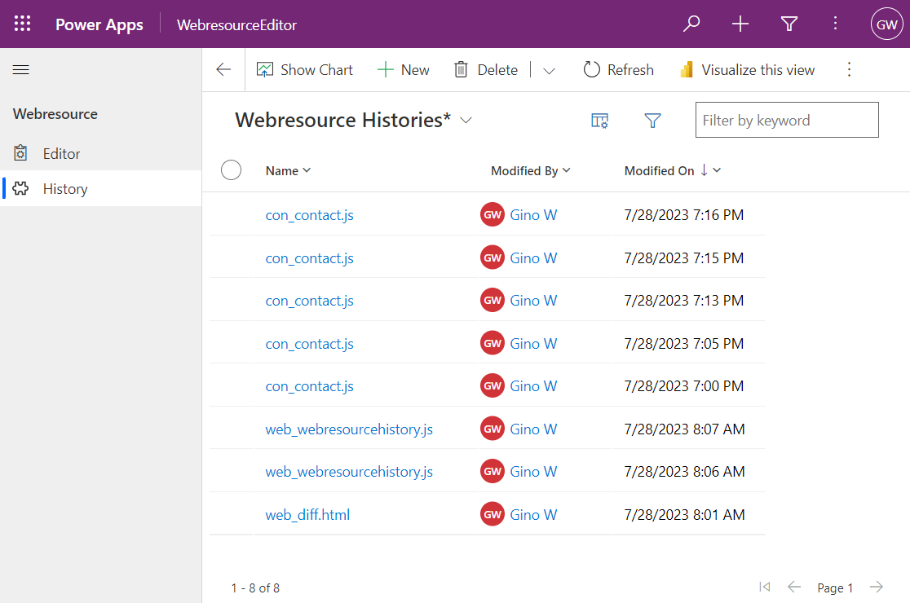
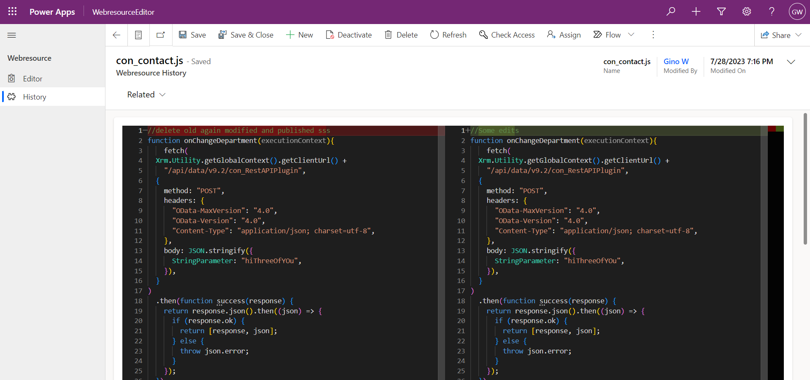
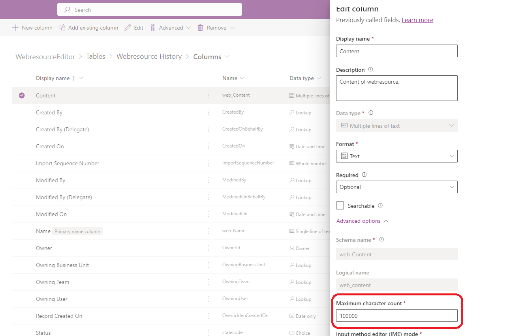

## Introduction

Modifying webresources in D365 CRM is a cumbersome process. If we directly edit the scripts in CRM then intellisense and formatting options aren't available and syntax errors aren't detected. So normally we download and open these webresources in code editors like VS Code and then upload it back into CRM.
The solution for above problem is to have an editor like VS Code in the CRM itself. This is achievable by using the Monaco editor which is what powers VS Code, and is open sourced by Microsoft.

## Demo

## Installation

- Download and import the managed solution `WebresourceEditor_managed.zip` from the [releases](https://github.com/ginow/WebresourceEditor/releases) section of this project.

## Usage

- Navigate to `Solutions` under settings and click on the `Webresource Editor` button

  

- Enter any webresource name you want to edit.

  For example for below webresource the name will be `con_samplewebresource.js`. You can even partially enter the name like `sample`.

  

- Press CTRL+S to save, CTRL+P to publish or CTRL+SHIFT+P to save and publish.

  

- Press CTRL+O to open the webresource in new tab.
- Almost all other keyboard shortcuts of VS Code editor will work as well.

## Using the Model driven app to edit and see history (New feature)
- Play the model driven app "WebresourceEditor" present in the solution

  

- After doing the edits you can see the history as well

  
  
- Double click on any history, the webresource will be compared with the latest version present in the system.

  

## References

- Monaco editor: https://microsoft.github.io/monaco-editor/playground.html

## Limitations set for safety
- This tool has no limitations but still for safety of your D365 org and applications below limitations have been set: 
  - Currently this tool will limit the maximum history at any point of time to 5000 records. If more histories are generated then the oldest history is deleted first. This limitation can be removed or changed by updating the source code of plugin.
  - The maximum characters the webresource can be compared is limited to 100000 characters. This limitation can be changed by modifying the character count limit of `web_content` field of `web_webresourcehistory` table

    