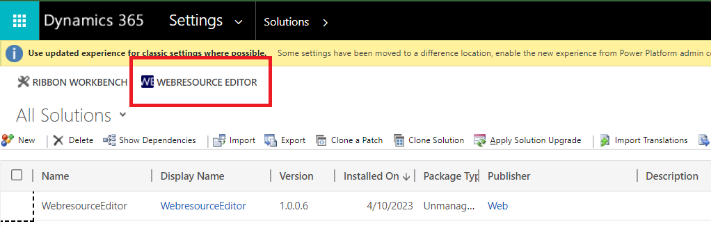
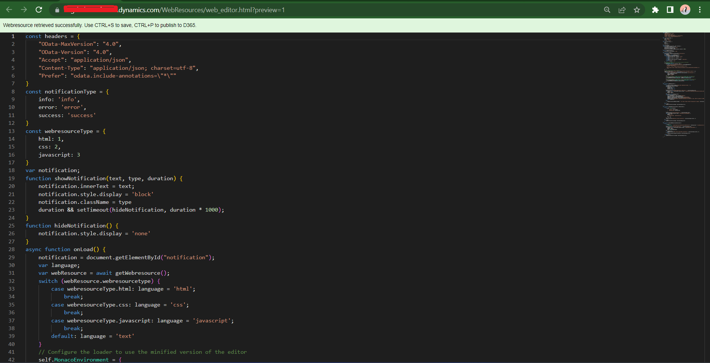

## Introduction

Modifying webresources in D365 CRM is a cumbersome process. If we directly edit the scripts in CRM then intellisense and formatting options aren't available and syntax errors aren't detected. So normally we download and open these webresources in code editors like VS Code and then upload it back into CRM.
The solution for above problem is to have an editor like VS Code in the CRM itself. This is achievable by using the Monaco editor which is what powers VS Code, and is open sourced by Microsoft.

## Demo

## Installation

- Download and import the managed solution `WebresourceEditor_managed.zip` from the [releases](https://github.com/ginow/WebresourceEditor/releases) section of this project.

## Usage

- Navigate to `Solutions` under settings and click on the `Webresource Editor` button

  

- Enter any webresource name you want to edit.

  For example for below webresource the name will be `con_samplewebresource.js`. You can even partially enter the name like `sample`.

  

- Press CTRL+S to save, CTRL+P to publish or CTRL+SHIFT+P to save and publish.

  

- Press CTRL+O to open the webresource in new tab.
- Almost all other keyboard shortcuts of VS Code editor will work as well.

## References

- Monaco editor: https://microsoft.github.io/monaco-editor/playground.html

### Work in progress:
- create a model driven app
- create WebresourceHistory entity with
  - Name (webresource schema name)
  - content 
- in post operation plugin create new webresource 
- when double click on webreshistory then compare with latest
- when select two and click compare
- system job to delete
